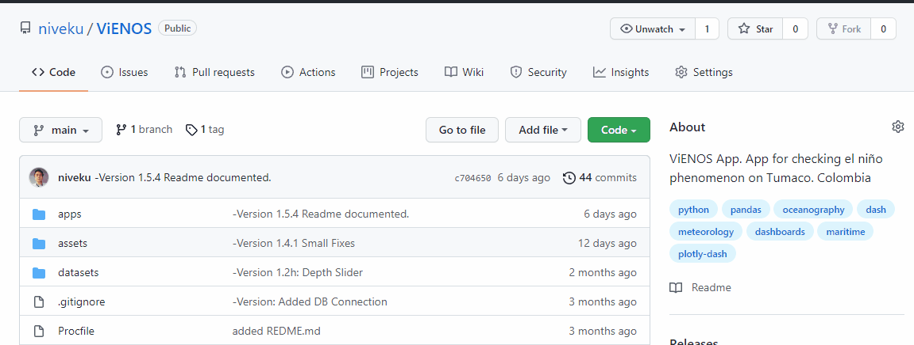
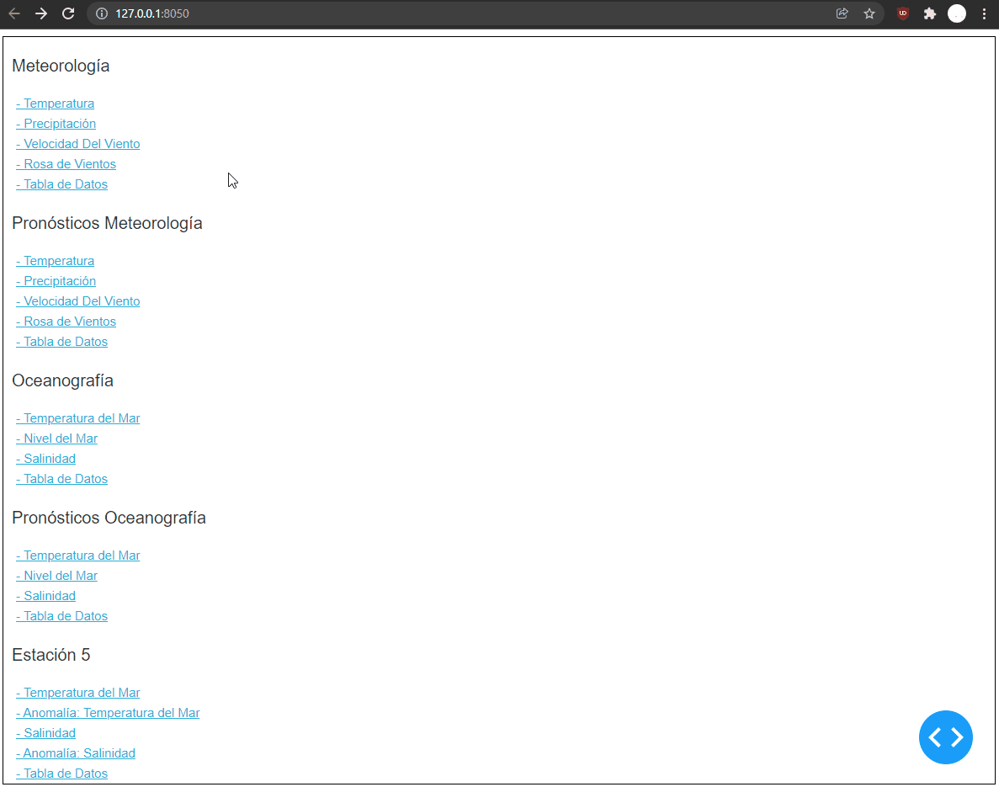
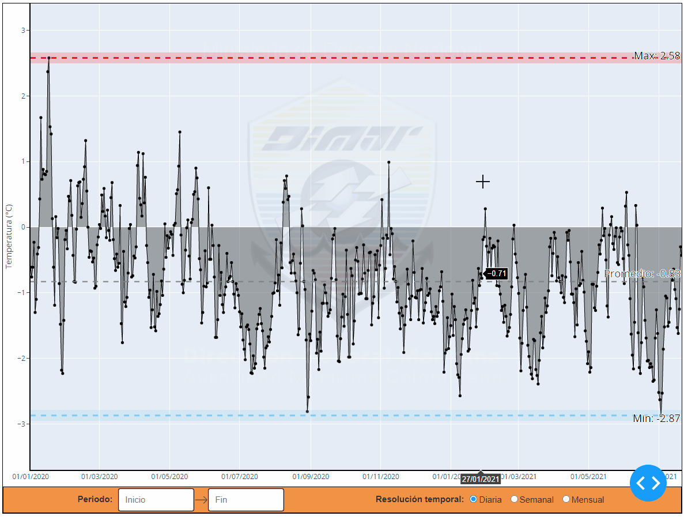
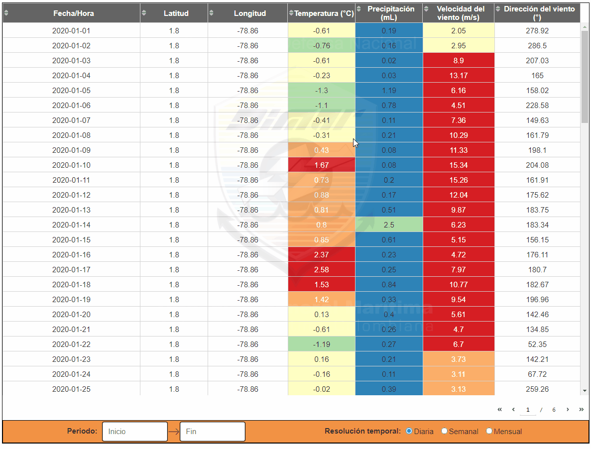
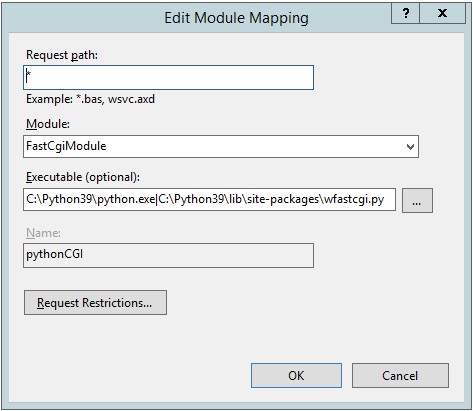
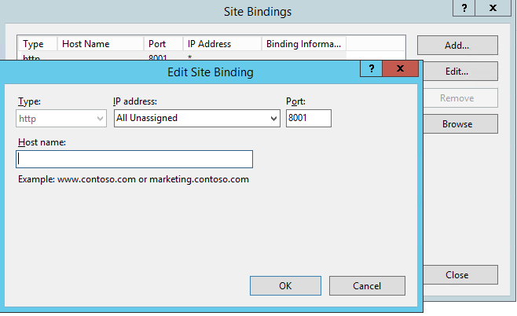
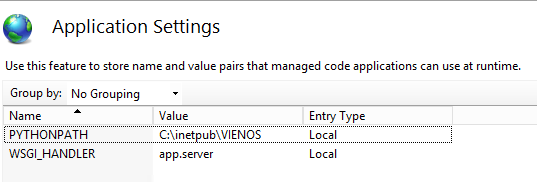

<h1 align="center">VIENOS - Vigilancia Integrada del fenómeno de "El Niño"</h1> 

VIENOS es un proyecto de la dirección general marítima colombiana ([Dimar](https://www.dimar.mil.co/)) el cual busca
dar un seguimiento y vigilancia integrada al fenómeno de "El niño". La aplicación aquí presentada, consta de una 
serie de tableros de control ("Dashboards") interactivos, dispuestos como servicios web. Estos dashboards permiten 
filtrar e interactuar con la información oceanográfica y meteorológica reunida y dispuesta por el Centro de 
Investigaciones Oceanográficas e Hidrográficas (CIOH o CCCP) Pacífico. Este centro de investigaciones se encuentra 
ubicado en Tumaco, en el pacífico colombiano.

## Tabla de contenidos

1. [Objetivo](https://github.com/niveku/ViENOS#1-objetivo)
2. [Alcance](https://github.com/niveku/ViENOS#2-alcance)
3. [Uso](https://github.com/niveku/ViENOS#3-uso)
   * [3.1 Uso local](https://github.com/niveku/ViENOS#31-uso-local)
   * [3.2 Uso de la aplicación](https://github.com/niveku/ViENOS#32-uso-de-la-aplicaci%C3%B3n)
      - [3.2.1 Navegación](https://github.com/niveku/ViENOS#321-navegaci%C3%B3n)
      - [3.2.2 Filtros](https://github.com/niveku/ViENOS#322-filtros)
      - [3.2.3 Gráficos](https://github.com/niveku/ViENOS#323-gr%C3%A1ficos)
      - [3.2.5 Despliegue en servidor windows](https://github.com/niveku/ViENOS#325-despliegue-en-servidor-windows)
4. [Requerimientos](https://github.com/niveku/ViENOS#4-requerimientos)
   * [4.1 Librerias](https://github.com/niveku/ViENOS#41-librerias)
   * [4.2 Otros requerimientos](https://github.com/niveku/ViENOS#42-otros-requerimientos)
5. [Arquitectura del sistema](https://github.com/niveku/ViENOS#5-arquitectura-del-sistema)
   * [5.1 Arquitectura de la aplicación](https://github.com/niveku/ViENOS#51-arquitectura-de-la-aplicaci%C3%B3n)
   * [5.2 Arquitectura de la base de datos](https://github.com/niveku/ViENOS#52-arquitectura-de-la-base-de-datos)
   * [5.3 Arquitectura de la página](https://github.com/niveku/ViENOS#53-arquitectura-de-la-p%C3%A1gina)
6. [Licencia](https://github.com/niveku/ViENOS#licencia) 

## 1. Objetivo

Especificamente, esta herramienta busca facilitar la presentación de datos oceanográficos y meteorológicos, a través 
de un conjunto de dashboards interactivos que permiten diferentes filtros y agrupaciones temporales.
Estos datos son presentados en forma de graficos de líneas, tablas de datos y rosas de viento.

## 2. Alcance

Este aplicativo web está dirigido a todas las personas que busquen visualizar datos oceanográficos y meteorológicos 
de seguimiento al "Fenómeno del Niño" en el pacífico colombiano. Los usuarios pueden de la comunidad en general o 
profesionales internos o externos a Dimar.

Adicionalmente, el código de la aplicación está orientado a ser escalable y fácil de leer. Permitiendo pensar en 
futuras adiciones de funcionalidades y recuros a esta. Esto, con miras en brindar un servicio más robusto en la 
visualización de dicho datos.

## 3. Uso

Esta aplicación está en proceso de despliegue, una vez se disponga la dirección web definitiva se hará pública y 
abierta al público para la consulta y visualización de datos. No obstante, existe una versión de prueba, de una 
prototípo anterior, que puede encontrarse en: https://vienos.herokuapp.com/

Asimismo, una muestra de cómo se integrará esta aplicación a la plataforma se puede encontrar en el portal
[VIENOS](https://experience.arcgis.com/experience/4c38ce858add4d22aa68549a7fdd56ad/page/page_0/), en el cual se puede
apreciar el alcance y objetivos del proyecto, así como la idea para la presentación de información y la integración 
con esta aplicación web.

### 3.1 Uso local



Para generar una versión local, la mejor opción es descargar el proyecto desde el repositorio o clonarlo usando el 
siguiente comando de git:

```
$ git clone https://github.com/niveku/ViENOS
```
Una vez clonado el código. Es necesario tener una versión de python funcional, ya sea general o un ambiente virtual 
(venv). Además, es necesario instalar las librerías y tener los otros archivos especificados en la sección de 
[requerimientos](https://github.com/niveku/ViENOS#4-requerimientos).

Para correr el programa localmente es necesario ejecutarlo desde el archivo index.py, desde la terminal o 
desde el IDE de su gusto.

```
$ python index.py
```

La aplicación se ejecuta localmente desde este módulo, ya que en este archivo se encuentra la siguiente instrucción.
```python
from app import app

if __name__ == '__main__':  # Ejecución local de la aplicación.
    app.run_server(  # Modo de ejecución de la app.
        debug=True  # True presenta un menu debugger en la app con callbacks y errores | False = Modo producción
    )
```
>**NOTA:** Cabe resaltar que ejecutando la aplicación desde este archivo (localmente), se iniciará en modo debugger.
Este modo permite revisar el funcionamiento de los llamados interactivos ("callbacks") y la trazabilidad de los
errores generados durante la ejecución. Es común que los servidores llamen directamente el módulo de la aplicación por
lo que no se inicia en modo debugger. Si se llegara a presentar este caso en un ambiente de producción, se debe cambiar
la configuración de inicio de la aplicación en el servidor.

Una vez el programa se haya ejecutado correctamente, la interfaz podrá ser accedida en la dirección y puerto que indique
la terminal. Por defecto, el localhost será http://127.0.0.1:8050/

### 3.2 Uso de la aplicación

La aplicación está pensada para ser de fácil uso, interactiva e intuitiva para todos los usuarios, con el objetivo de 
visualizar de los datos de forma sencilla y completa. 

La aplicación consta de gráficos, tablas y filtros. En cada una de las páginas, o secciones del aplicativo, se 
presentan dos segmentos de área. Uno principal, en donde se aloja la visualización de la gráfica o la tabla. Otro, el
segmento secundario, en donde están ubicados los filtros y agrupaciones temporales que interactuan con la sección 
principal.

A continuación se presentará un breve manual sobre el uso de 
esta aplicación.


#### 3.2.1 Navegación

Aunque la aplicación será accedida principalmente de manera embebida en las distintas páginas del portal 
[VIENOS](https://experience.arcgis.com/experience/4c38ce858add4d22aa68549a7fdd56ad/page/page_0/), la aplicación web
cuenta con un menú de navegación sencillo HTML. El cual le permite a los desarrolladores, y usuarios de las versiones 
locales, cambiar de forma sencilla entre las distintas páginas, gráficos e información de la aplicación.



#### 3.2.2 Filtros

Los filtros son el medio de interacción primordial entre el usuario y los datos. Permiten limitar y agrupar de 
distintas formas la información presentada en la aplicación y están presentes tanto para los gráficos, como para 
las tablas de datos. Estos filtros son los siguientes:

1. Periodo: Permite filtrar la fecha inicial y final de los datos presentados. Estas fechas están restringidas por las
fechas disponibles en la información base. Para usar el filtro se debe dar clic a las áreas de entrada de datos, 
demarcadas por "Inicio" y "Fin". Esto activará un menú de fechas a modo calendario, en el cual se deberá seleccionar 
las fechas a filtrar. También, se puede ingresar las fechas en los recuadros de texto en el formato indicado 
(dd-mm-aaaa).
2. Resolución temporal: Permite agrupar los datos presentados en distintos periodos de tiempo, ampliando así la
capacidad de análisis. Estas opciones están restringidas por la granularidad temporal de los datos y el objetivo 
de estos. Es tan fácil como hacer clic en las opciones para cambiar entre tipos de agrupación.
3. Profundidad: Filtro especial para la sección de estación 5, ubicada en la parte izquierda de las gráficas.
Este filtro permite seleccionar la profundidad única de los datos presentados. Para usarlo solo se debe arrastras la 
manija (círculo) de la barra de deslizamiento hasta la profundidad deseada. Para el caso de la tabla de la sección 
"Estación 5", este filtro se cambia por un input numérico sencillo que cumple la misma función.



#### 3.2.3 Gráficos

La aplicación presenta dos tipos de gráficos: los gráficos de líneas y los diagramas de rosa de viento 
(gráficos polares). Estos permiten acercar a detalles haciendo clic + arrastre y generando un rectángulo en la zona que
se desea apreciar más de cerca. También, permiten moverse por las dimensiones arrastrando los ejes "X" y "Y".
Finalmente, para salir del modo de detalles ("zoom"), se hace un doble clic en una zona vacía. 

Por otro lado, las gráficas presentan detalles de los datos por los que se navega a forma de etiquetas, que distinguen
los valores asociados en los ejes "X" y "Y". Adicionalmente, se dan unas líneas de referencia, exclusivo para el 
gráfico de líneas, con los valores mínimos, máximos y promedio de los datos presentados.


#### 3.2.4 Tablas

La aplicación cuenta con secciones de tablas, asociadas a cada sección de datos, en las cuales se presenta la 
información tabulada, a partir de la cual se contruyen los gráficos presentados en las otras páginas. Estas tablas
presentan la información con ayudas visuales asociados a la rampa de colores de los datos de cada columna. También,
permite organizar los datos por los valores de la columna indicada.

Es importante resaltar que cuando se encuentran bastantes datos, la tabla se divide en varias páginas, con un menú de
navegación ubicado en la parte inferior-derecha. Esto para que los datos sean segmentados y entregados de acuerdo 
a la necesidad y no saturen la aplicación.

Las tablas cuentan, igualmente, con la división de filtros y opciones, las cuales permiten limitar y agrupar los datos,
tal cual como se hacen en los gráficos. Esto añade versatilidad al análisis de los datos provistos,
permitiendo apreciar cambios en diferentes agrupaciones temporales.



#### 3.2.5 Despliegue en servidor windows

Para el despliegue en servidor windows (IIS) se deben seguir los siguientes pasos:

1. Habilitar el servicio CGI dentro de los servicios de roles del IIS.

    
2. Instalar una instancia de Python, con permisos de administrador, en una carpeta de raíz. Ej. C://Python39.
Asegurarse de que el usuario que ejecuta el IIS tenga permisos sobre la carpeta.
3. Instalar todas las librerías requeridas para la ejecución de la app, detallados en 
[requirements](https://github.com/niveku/ViENOS/blob/main/requirements.txt). Adicionalmente, es necesario
instalar la librería wfastcgi.
4. Habilitar el FastCGI desde un comando en una ventana de CMD.
```
wfastcgi-enable
```
5. Agregar un handler para python en la opción “Handler Mappings” del menú del IIS. Este debe usar el módulo
FastCgiModule y apuntar al ejecutable de python y al módulo wfastcgi.py.


6. Crear una nueva página o dirección asociada a la carpeta donde se almacenan todos los datos de la aplicación.
Configurar los binds: Ip, puerto, hostname y certificado, en caso tal de poseerlo, para que la app funcione en línea.


7. Revisar en la opción de "Aplication Settings" que la aplicación esté configurada de la siguiente forma 
(El de WSGI handler debe apuntar al app.server):


8. Revisar que en la carpeta de la app se cree un archivo web.config que esté dispuesto de manera similar a esto:
```
<?xml version="1.0" encoding="UTF-8"?>
<configuration>
    <system.webServer>
        <handlers>
            <remove name="Python" />
            <add name="pythonCGI" path="*" verb="*" modules="FastCgiModule" 
            scriptProcessor="C:\Python39\python.exe|C:\Python39\lib\site-packages\wfastcgi.py" 
            resourceType="Unspecified" requireAccess="Script" />
        </handlers>
    </system.webServer>
    <appSettings>
        <add key="PYTHONPATH" value="C:\inetpub\VIENOS" />
        <add key="WSGI_HANDLER" value="app.server" />
    </appSettings>
</configuration>
```
8. Cambiar los contenidos del archivo index.py al archivo app.py. Esto es necesario, ya que el FastCGI inicia
la app desde app.py y no desde el index.py, como pasa en una ejecución local.
```python
import ...
...

app.layout = html.Div(
    id='ENOS_APP',
    children=[
        dcc.Location(id='url', refresh=False),
        html.Div(
            id='page-content',
            children=[],
        ),
    ],
)

@app.callback(Output('page-content', 'children'),
              Input('url', 'pathname'))
def display_page(pathname):
    ...
```

Para revisar otros pasos a profundidad, por favor revisar esta 
[guía](https://medium.com/@dpralay07/deploy-a-python-flask-application-in-iis-server-and-run-on-machine-ip-address-ddb81df8edf3) 
.
## 4. Requerimientos:

La aplicación está construida en python 3.8.5 por lo que se necesitará de un ambiente con Python 3+ con las librerias 
adecuadas para correr de manera local.

### 4.1 Librerias

Esta plataforma está basada principalmente en las siguientes librerias:

- Flask
- Dash (1.21)
- Plotly
- Pandas
- Pyodbc
- Colorlover

Para ver una lista detallada de los requerimientos revisar el archivo
[requirements.txt](https://github.com/niveku/ViENOS/blob/main/requirements.txt).

Igualemente, las librerías necesarias se pueden instalar ejucatando el siguiente comando en la carpeta principal de la 
aplicación:

```
pip install - r requirements.txt
```

>**NOTA:** Es importante que la versión de Dash sea la versión 1.21, ya que la siguiente versión lanzada es la 2.0 en la
que se cambiaron aspectos importantes del funcionamiento e importación de librerias de este paquete. Por lo que aún
no es compatible con esta aplicación.


### 4.2 Otros requerimientos

Es necesario tener un archivo llamado "settings.py" en la raiz de la aplicación con los usuarios y contraseñas para el
ingreso a las bases de datos. Esto junto a un entorno o conexión VPN que permita la conexión con la base de datos.
De lo contrario, la aplicación trabajará de manera fuera de línea ("offline") con los archivos de respaldo .csv 
guardados.

```python
import settings

# Datos provenientes del archivo settings.py local
username = settings.username
password = settings.password
```

## 5. Arquitectura del sistema

Esta aplicación está construida enteramente en Python, ya que necesita una gran capacidad de transformación y agrupación
de datos. Para ello, se implementó agrupaciones y transformaciones de datos empleando la librería de Pandas para python.
Para la parte visual se trabajó con la librería de Dash para Python, la cual se especializa en la creación de dashboards 
interactivos web, basados en HTML+CSS, Plotly, Flask y React.

### 5.1 Arquitectura de la aplicación
```
ViENOS
| .gitignore
| app.py
| index.py
| Procfile
| README.md
| requirements.txt
| settings. py
|
|-- apps
|   | __init__.py
|   | components.py
|   | estacion5.py
|   | graphs.py
|   | meteo.py
|   | meteo_fcst.py
|   | misc.py
|   | ocean.py
|   | ocean_fcst.py
|   | windrose.py
|
|-- assets
|   |--- doc_files
|   |   |...
|   | cecoldo_logo.png
|   | dash.css
|   | favicon.ico
|   | watermark.png
|
|-- datasets
|   | ESTACION5_OCEAN_Q.csv
|   | TUMACO_METEO_FCST_H.csv
|   | TUMACO_METEO_H.csv
|   | TUMACO_OCEAN_D.csv
|   | TUMACO_OCEAN_FCST_D.csv
```

- gitignore: Contiene la información de las carpetas y archivos a ignorar en el repositorio. Es importante que el 
archivo settings.py (con las contraseñas y usuarios) este referenciado acá.
- app.py: Módulo principal encargado de generar la aplicación y el servidor asociado.
- index.py Módulo que maneja la página principal y las conexiones a las distintas páginas de la aplicación.
- Procfile: Archivo de texto que maneja las interfaces de las apps en algunas plataformas de despliegue como heroku.
- README.md: Archivo de documentación básica de la aplicación.
- requirements.txt: Archivo de texto parametrizado que indica las librerías y versiones de Python necesarias para 
ejecutar el programa.
- settings.py: Módulo que almacena localmente contraseñas y usuarios requeridos para la conexión a la base de datos.


- **apps: Carpeta empaquetada con los códigos de cada parte de la aplicación:**
  + \_\_init\_\_.py: Archivo que indica la naturaleza empaquetada de la carpeta o módulo.
  + components.py: Módulo que se encarga de generar todos los componentes funcionales interactivos de los dashboards.
Es decir, los inputs, sliders, gráficas y tablas.
  + estacion5.py: Módulo que se encarga del funcionamiento y presentación de la página de "Estación 5" (/estacion5).
  + estacion5_table: Módulo que se encarga del funcionamiento y presentación de la página de tablas para 
"Estación 5" (/estacion5).
  + graphs.py: Módulo que se encarga de la creación y validación de los gráficos de la aplicación.
  + meteo.py: Módulo que se encarga del funcionamiento y presentación de la página de Meteorología (/meteo).
  + meteo_fcst.py: Módulo que se encarga del funcionamiento y presentación de la página de Predicción Meteorología
(/meteo_fcst).
  + misc.py: Módulo que se encarga de todas las funciones complementarias de la aplicación. Incluyen entre otras: 
conexiones a bases de datos, carga y adecuación de información, manejos de estilos, entre otros.
  + ocean.py: Módulo que se encarga del funcionamiento y presentación de la página de Oceanografía (/ocean).
  + ocean_fcst.py: Módulo que se encarga del funcionamiento de la página de predicciones oceanográficas (/ocean_fcst).
  + windrose.py: Módulo que se encarga de la manipulación de los datos originales para generar un DataFrame adecuado
para la presentación de la información en una rosa de vientos (Rose Diagram). Con las columnas y nombres estandarizados.
- **assets: Carpeta que contiene archivos e imágenes adicionales relacionados con la estética de la aplicación.**
  + doc_files: Carpeta con archivos multimedia que respaldan la documentación de la aplicación.
  + ceoldo_logo.png: Logo de cecoldo empleado en versiones anteriores para generar un botón.
  + dash.css: Archivo de definición de estilos HTML-CSS para la aplicación y sus componentes.
  + favicon.ico: Logo que aparece en la pestaña de la página en los navegadores.
  + watermark.png: Logo de Dimar empleado para la marca de agua de la aplicación.
- **datasets: carpeta con los archivos .csv de respaldo de las tablas que maneja la aplicación.**

### 5.2 Arquitectura de la base de datos

La base de datos está alojada en un servidor de Dimar, por lo que es necesario tener las conexiones y permisos adecuados
para su consulta.

La base de datos se estructura de la siguiente manera:

```
BTASQLCLUSIG
|--- SIGDIMAR
|   |--- SIGDIMAR
|   |   | TUMACO_METEO_H
|   |   | TUMACO_METEO_FCST_H
|   |   | TUMACO_OCEAN_D
|   |   | TUMACO_OCEAN_FCST_D
|   |   | ESTACION5_OCEAN_Q
```

Estas tablas se transforman en estructuras DataFrame dentro de python utilizando las librerias de Pandas y pyodbc
de esta forma:

```python
import settings
import pandas as pd
import pyodbc

server = "BTASQLCLUSIG\\SIGDIMAR"  # Tener cuidado con el "\"
database = 'SIGDIMAR'

# Datos provenientes del archivo settings.py local
username = settings.username
password = settings.password

table = ""  # Tablas válidas:TUMACO_METEO_H, TUMACO_METEO_FCST_H, TUMACO_OCEAN_D, TUMACO_OCEAN_FCST_D, ESTACION5_OCEAN_Q

cnxn = pyodbc.connect(
    'DRIVER={SQL Server};SERVER=' + server +
    ';DATABASE=' + database +
    ';UID=' + username +
    ';PWD=' + password
)

dataframe = pd.read_sql_query('SELECT * FROM [Esquema_Vienos].[' + table + ']', cnxn)
```

### 5.3 Arquitectura de la página

La página cuenta con un índice, el cual actuará como página de inicio para la aplicación alojada en un servicio web.
Esta página permite a los desarrolladores una fácil navegación a través de las distintas secciones del aplicativo.
El resto de la aplicación estará dispuesta de la siguiente forma:

```
root/ (index)
|
|--- /meteo 
    |  /temp
    |  /prcp
    |  /wvel
    |  /wdir
    |  /table
|--- /meteo_fcst
    |  /temp
    |  /prcp
    |  /wvel
    |  /wdir
    |  /table
|--- /ocean 
    |  /sst
    |  /ssh
    |  /ss
    |  /table
|--- /ocean_fcst
    |  /sst
    |  /ssh
    |  /ss
    |  /table
|--- /estacion5
    |  /sst
    |  /ssta
    |  /ss
    |  /ssa
    |  /table
```
**Página principal**
- /root: Índice con los enlaces a las diferentes partes funcionales de la aplicación.

**Sección de meteorología**

Conformado por las secciones de /meteo y /meteo_fcst, son divisiones que alojan lás páginas de las variables de 
información y los pronósticos meteorológicos, respectivamente. Estas secciones no son funcionales por sí solas, ya que 
requieren de una de las siguientes variables (sub-secciones) para presentar información:
- /temp (Temperature): Temperatura en un gráfico de líneas.
- /prcp (Precipitation): Precipitación en un gráfico de líneas
- /wvel (Wind Velocity): Velocidad (magnitud) del viento en un gráfico de líneas.
- /wdir (Wind Direction): Velocidad (vector) del viento representado en una rosa de vientos.
- /table: Tabla (DataFrame) de toda la información del conjunto de datos.


**Sección Oceanográfica**

Conformado por las secciones de /ocean y /ocean_fcst, son divisiones que alojan lás páginas de las variables de 
información y los pronósticos oceanográficos, respectivamente. Estas secciones no son funcionales por sí solas, ya que 
requieren de una de las siguientes variables (sub-secciones) para presentar información:
- /sst (Sea Surface Temperature): Temperatura superficial del mar en un gráfico de líneas.
- /ssh (Sea Surface Height): Nivel del mar en un gráfico de líneas.
- /ss (Sea Salinity): Salinidad del mar en un gráfico de líneas.
- /table: Tabla (DataFrame) de toda la información del conjunto de datos.

**Sección "Estación 5"**

Conformado por la sección /estacion5. Esta cuenta con la información del proyecto insignia del CIOH/CCCP pacífico, una
estación de mediciones oceanográficas ubicada en Tumaco, Nariño. Esta división no es funcional por sí sola, ya que 
requiere de una de las siguientes variables (sub-secciones) para presentar información:
- /sst (Sea Surface Temperature): Temperatura superficial del mar en un gráfico de líneas.
- /ssta (Sea Surface Temperature Anomaly): Anomalía calculada de la temperatura superficial del mar en un gráfico
de líneas.
- /ss (Sea Salinity): Salinidad del mar en un gráfico de líneas.
- /ssa (Sea Salinity Anomaly): Anomalía calculada de la salinidad del mar en un gráfico de líneas.
- /table: Tabla (DataFrame) de toda la información del conjunto de datos.

## Licencia
[MIT](https://choosealicense.com/licenses/mit/)

<center>Dimar 2021 ©</center>